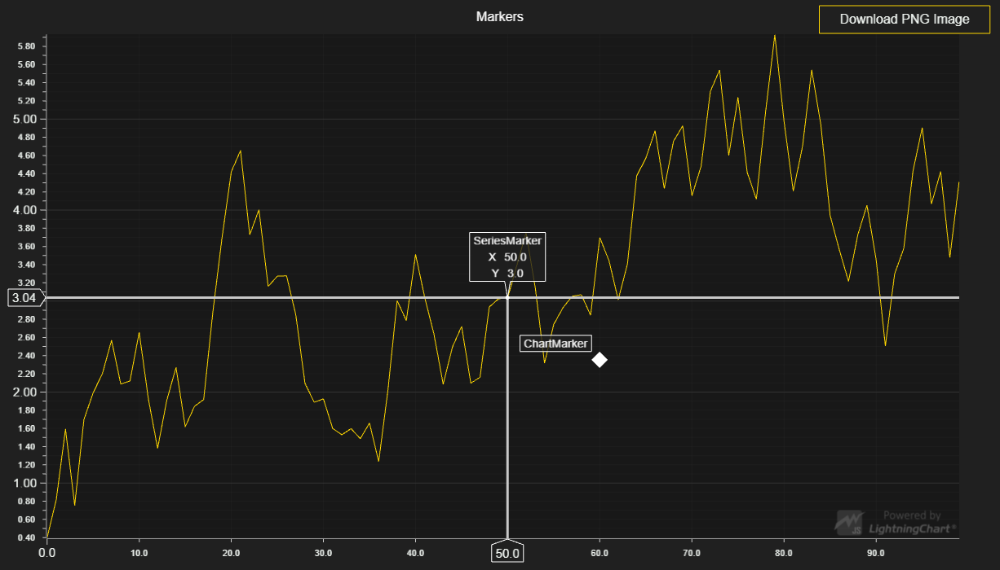

# Markers

This demo application belongs to the set of examples for LightningChart JS, data visualization library for JavaScript.

LightningChart JS is entirely GPU accelerated and performance optimized charting library for presenting massive amounts of data. It offers an easy way of creating sophisticated and interactive charts and adding them to your website or web application.

The demo can be used as an example or a seed project. Local execution requires the following steps:

- Make sure that relevant version of [Node.js](https://nodejs.org/en/download/) is installed
- Open the project folder in a terminal:

        npm install              # fetches dependencies
        npm start                # builds an application and starts the development server

- The application is available at *http://localhost:8080* in your browser, webpack-dev-server provides hot reload functionality.

## Description

This example shows usage of different Markers of the ChartXY environment.
Markers are custom UI-elements that can be used to draw custom cursors from user side. There are two types of Markers:

## ChartMarker

This type of Marker is placed along two arbitrary axes belonging to a ChartXY. It is positioned with axis values, and will look exactly like an AutoCursor. It also has the same capabilities as one - only difference being that it isn't automatically positioned and hidden when needed, users have full power over this logic.

## SeriesMarker

SeriesMarkers are a part of certain series (line-series, OHLC, ...?), that can be created using series-method: *addMarker*. Once again, the SeriesMarker doesn't look any different from other Markers, the only logic which it adds is that it automatically latches to the nearest data-point of its owning series, from its current location (which can be set using method: *setPosition*)

## API Links

* [XY cartesian chart]
* [Auto cursor modes]
* [Progressive line series]
* [Marker XY builder]
* [UI backgrounds]
* [RGBA color factory]
* [UIDirections]
* [Point marker]
* [Result table]
* [ChartXY marker]
* [Visibility modes for Markers]

## Support

If you notice an error in the example code, please open an issue on [GitHub][0] repository of the entire example.

Official [API documentation][1] can be found on [Arction][2] website.

If the docs and other materials do not solve your problem as well as implementation help is needed, ask on [StackOverflow][3] (tagged lightningchart).

If you think you found a bug in the LightningChart JavaScript library, please contact support@arction.com.

Direct developer email support can be purchased through a [Support Plan][4] or by contacting sales@arction.com.

[0]: https://github.com/Arction/
[1]: https://www.arction.com/lightningchart-js-api-documentation/
[2]: https://www.arction.com
[3]: https://stackoverflow.com/questions/tagged/lightningchart
[4]: https://www.arction.com/support-services/

© Arction Ltd 2009-2020. All rights reserved.

[XY cartesian chart]: https://www.arction.com/lightningchart-js-api-documentation/v2.1.0/classes/chartxy.html
[Auto cursor modes]: https://www.arction.com/lightningchart-js-api-documentation/v2.1.0/enums/autocursormodes.html
[Progressive line series]: https://www.arction.com/lightningchart-js-api-documentation/v2.1.0/classes/progressivelineseries.html
[Marker XY builder]: https://www.arction.com/lightningchart-js-api-documentation/v2.1.0/globals.html#markerbuilders
[UI backgrounds]: https://www.arction.com/lightningchart-js-api-documentation/v2.1.0/globals.html#uibackgrounds
[RGBA color factory]: https://www.arction.com/lightningchart-js-api-documentation/v2.1.0/globals.html#colorrgba
[UIDirections]: https://www.arction.com/lightningchart-js-api-documentation/v2.1.0/enums/uidirections.html
[Point marker]: https://www.arction.com/lightningchart-js-api-documentation/v2.1.0/interfaces/pointmarker.html
[Result table]: https://www.arction.com/lightningchart-js-api-documentation/v2.1.0/interfaces/resulttable.html
[ChartXY marker]: https://www.arction.com/lightningchart-js-api-documentation/v2.1.0/classes/chartmarkerxy.html
[Visibility modes for Markers]: https://www.arction.com/lightningchart-js-api-documentation/v2.1.0/enums/uivisibilitymodes.html

